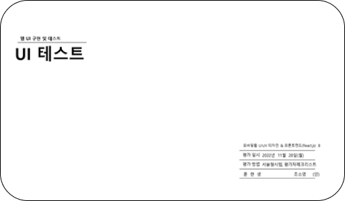

<h1> 📌 AJou University Hospital _ Renewal Site</h1>

<h3>아주대학교 병원 사이트 리뉴얼</h3>

 

<h2>Before & After</h2>

 

<h2>💡 Site Renewal </h2>

**국내 종합병원 아주대학교 병원의 사이트를 리뉴얼하였습니다.**  
사이트 선정과 기획, 벤치마킹, 와이어프레임 스케치와 스토리보드 작성, Adobe XD를 사용한 프로토타입 제작까지 직접 작업했습니다.
 
사이트 기획에 대한 지식이 하나도 없던 저에게 유의미한 시작이 되었던 작업물입니다. 
Slick.js와 Scrolla.js 라이브러리를 사용했습니다.

 

<h2>👀 리뉴얼 사이트 보기 (Click to View) </h2>
👉 <a href="https://breeghty.github.io/AjouUniv.hospital/">아주대병원 리뉴얼 사이트 😃 </a>

 

<h2>✔ 작업일자(Date)</h2>
2022.09.

 

<h2>✔ 키워드(Keyword)</h2>
- 기획 100% + 디자인 100% + 코딩 100% 
- 웹표준, 웹접근성 
- HTML, CSS, Javascript, jQuery, Adobe XD, Photoshop 
- 사이트 리뉴얼 평가, 웹디자인, 퍼블리싱

 

<h2>✔ 리뉴얼 과정 자세히 보기(Renewal Process)</h2>
<h3>이미지를 클릭해보세요!(Click to view!)</h3>

 

  

    
    
    <a href="./renewal_process/프로그래밍언어활용.pdf">
  

 

 

<h2>✔ 와이어프레임 스케치(Wire Frame Sketch)</h2>

 

  

  
  
  
  
  

 

<h2>✔ 프로토타입(Prototype) using <strong>Adobe XD</strong></h2>

 

  

  
  
  
  
  

